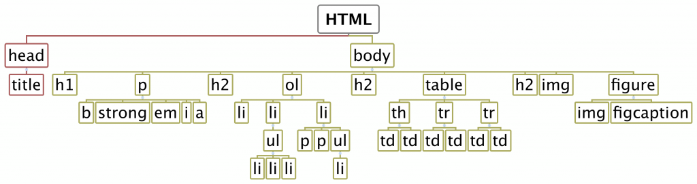
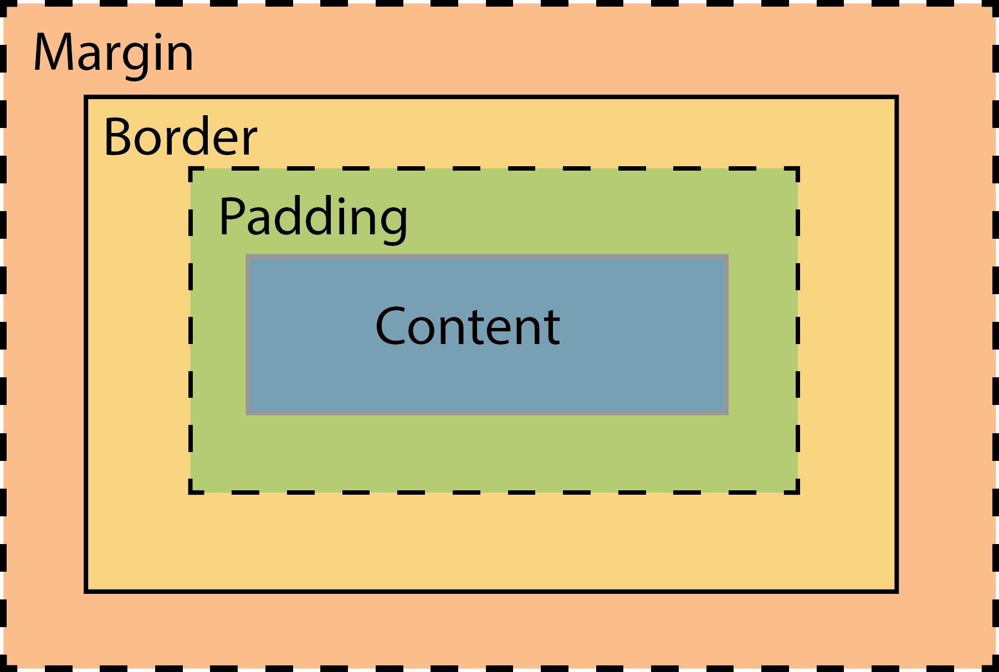

# HTML AND CSS

In these next few classes we will be talking about HTML and CSS (big surprise), we should cover the topics below.

## Read the notes

Please read these notes on HTML and CSS before coming to class:

* __[Online version](http://dna.pomona.edu/bio174/Readings/Chapter_1.html)__ (best online)
* __[Pdf file](../../SupportingMaterials/Chapter_1_HTML_CSS.pdf)__ (you can download to read offline but might have some problems because the original was written in HTML).

## Topics for the next class:

### MVC Model - HTML, CSS, and JAVASCRIPT

### HTML Editors

You should have installed Visual Studio Code already. To really enjoy the power of VS Code we will install some extensions in class.

## HTML:

### Tags:

* &lt;html>
* &lt;head>
* &lt;body>
* &lt;h1> ... &lt;h6>
* &lt;p>
* &lt;em>, &lt;i>, &lt;strong>, &lt;bold>
* &lt;a>
* &lt;ol>, &lt;ul>, &lt;li>
* &lt;table>, &lt;th>, &lt;tr>, &lt;td>, &lt;caption>
* &lt;thead>, &lt;tbody>, &lt;tfoot>
* &lt;img>
* &lt;figure>, &lt;figcaption>

### Block and inline elements

### Nesting of tags:

DOM - Document Object Model

### Dummy elements:

HTML is all about applying meaning to content.
Whereas most HTML tags apply meaning (p makes a paragraph, h1 makes a heading etc.),
the span and div tags apply no meaning at all.

They are used to group together a chunk of HTML and hook some information onto that
chunk, most commonly with the attributes class and id to associate the element with
a class or id CSS selector.

### Paths:

Absolute vs Relative

### CSS

### Attributes:

* background - background color
* font-size - in %, em, px, cm, small, medium, large, etc
* font-family
* line-height
* color - font color

### Colors and Units:

* Scalable vs absolute units.
* Colors: Some named like "red", can also use RGB values: #RRGGBB, hexadecimal.

### Positioning and the Box Model:

### id and class

### Advanced CSS selections:

By element and class: p.summary

https://www.w3schools.com/cssref/css_selectors.asp

## Markdown:

Read this article: https://guides.github.com/features/mastering-markdown/
